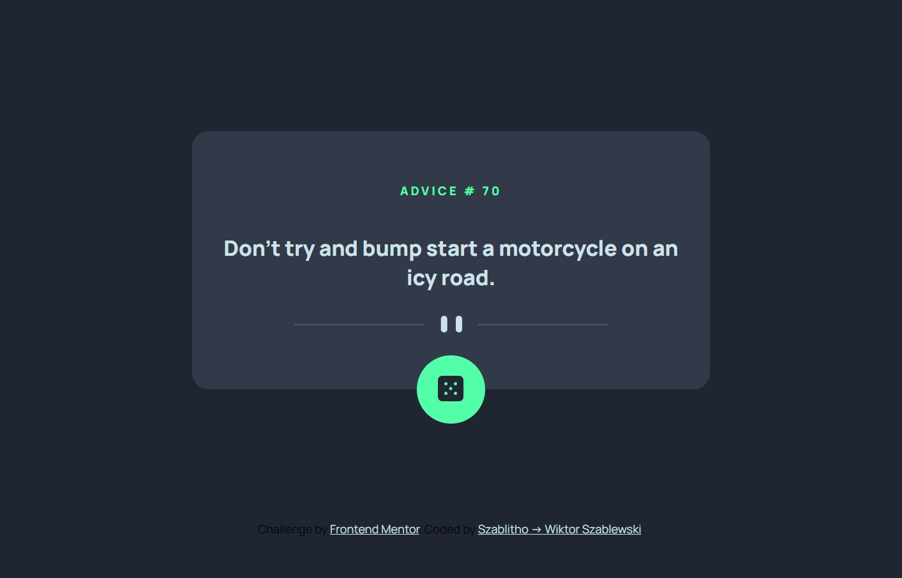

## Live view:
[GitHub Preview(https://szablitho.github.io/advice-generator-app/)]
# Frontend Mentor - Advice generator app solution

This is a solution to the [Advice generator app challenge on Frontend Mentor](https://www.frontendmentor.io/challenges/advice-generator-app-QdUG-13db). Frontend Mentor challenges help you improve your coding skills by building realistic projects.

## Table of contents

- [Overview](#overview)
  - [The challenge](#the-challenge)
  - [Screenshot](#screenshot)
  - [Links](#links)
- [My process](#my-process)
  - [Built with](#built-with)
  - [What I learned](#what-i-learned)
  - [Continued development](#continued-development)
  - [Useful resources](#useful-resources)
- [Author](#author)
- [Acknowledgments](#acknowledgments)

**Note: Delete this note and update the table of contents based on what sections you keep.**

## Overview

### The challenge

Users should be able to:

- View the optimal layout for the app depending on their device's screen size
- See hover states for all interactive elements on the page
- Generate a new piece of advice by clicking the dice icon

### Screenshot



### Links

- Solution URL: [Add solution URL here](https://github.com/Szablitho/advice-generator-app)
- Live Site URL: [Add live site URL here](https://szablitho.github.io/advice-generator-app/)

## My process
I started with building HTML. I used semenatics where it was possible and planned future classes for CSS and IDs of elements for script. I met difficulties working with svg as they are apparently not allowed in `<picture>` tag so i used a CSS display property and media queries to replace the on correct screens. I followed a guide of colors and screen sizes given to this project. Later i implemented JavaScript and using fetch API I have got a slip of advice fro Advice Slip API.
### Built with

- Semantic HTML5 markup
- CSS custom properties
- Flexbox
- Mobile-first workflow
- SVG
- Fetch API, Advice Slip API
- Git and GitHub
- Google Fonts


### What I learned


```css
#dice-background {
  position: absolute;
  left: calc(50% - 2rem);
  bottom: calc(0% - 2rem);
  background-color: var(--neon-green);
  height: 4rem;
  width: 4rem;
  border-radius: 2rem;
}
#dice {
  transform: translateY(1.2rem);
}
```
```js
const adviceCard = document.querySelector(".advice");
const adviceIDel = document.querySelector("#advice-id");
const diceEl = document.querySelector("#dice-background");

async function getAdvice() {
  const response = await fetch('https://api.adviceslip.com/advice');
  const advice = await response.json();

  if(!advice) {
    return alert("Something went wrong"); //do alternative message within an advice card
  }
  // update advice card with response from ADVICE SLIP API
  console.log(advice);
  adviceIDel.textContent = advice.slip.id;
  adviceCard.textContent = advice.slip.advice;
}
diceEl.addEventListener("click",getAdvice);

```


### Continued development

I want to focus on fetching datas with APIs and know more about JavaScript modules and/or frameworks. So that later i can use them in proffesional projects, deploy complex websites for marketing, responsive, useful and pretty.


### Useful resources

- [MDN docs about fetch API](https://developer.mozilla.org/en-US/docs/Web/API/Fetch_API/Using_Fetch) - i could understand how Fetch API works and how to write it to use GET. Hopefully in future uploading will not be a problem for me either.
- [Reqbin](https://reqbin.com/) - allows for fast check if API respond


## Author(to be updated)
### Wiktor Szablewski as Szablitho
- Github - [Szablitho](https://github.com/Szablitho)
- Frontend Mentor - [@yourusername](https://www.frontendmentor.io/profile/yourusername)
- LinkedIn - [Wiktor Szablewski](https://www.linkedin.com/in/wiktor-szablewski-605591256/)

## Acknowledgments

MDN helped me understand Fetch API bot on my way i also found few good explanations abouts SVG in Web. Thank you developers for knowledge and ressources,
Thank you FrontEnd mentor for allowing me make this project.
